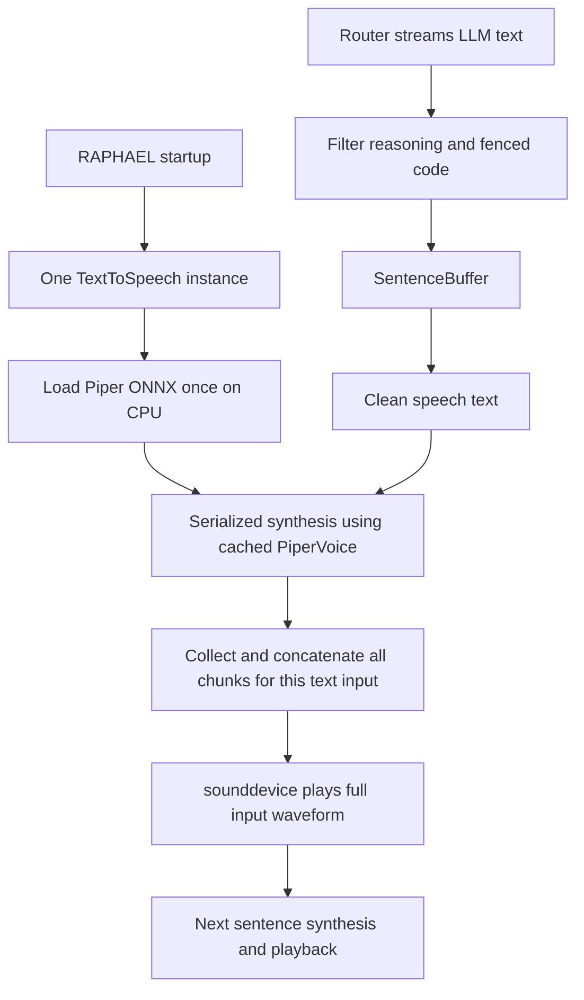

# Custom RAPHAEL voice: repository audit

Inspected 2026-10-05 on branch `feat/custom-voice-audit`, starting at `8005d31`.
This audit does not change the working engine, voice, models, or `.env`.

## Actual active configuration

The effective settings loaded by `get_settings()` are:

```text
TTS_ENGINE=piper
TTS_VOICE=en_US-raphael-medium
TTS_SPEED=0.8
TTS_STREAMING=true
STT_MODEL=small.en
STT_DEVICE=cuda
STT_COMPUTE_TYPE=int8_float16
STT_RETRY_MODEL=medium.en
WAKE_STT_MODEL=base.en
```

These differ from `.env.example` (`custom_voice`) and Python defaults
(`auto` / `mommy`, which resolves to Fish). They are not interchangeable evidence.
Piper package version is **1.8.0**, ONNX Runtime **1.30.0**. A voice config's
`piper_version` describes its artifact and is not the installed package version.

| Installed voice | ONNX bytes | Sample rate | Config version |
| --- | ---: | ---: | --- |
| en_US-raphael-medium (active) | 63,516,050 | 22,050 Hz | 1.5.0 |
| en_US-amy-medium | 63,201,294 | 22,050 Hz | 1.0.0 |
| en_GB-alan-medium | 63,201,294 | 22,050 Hz | 1.0.0 |
| custom_voice | 63,511,038 | 22,050 Hz | 1.0.0 |

Active ONNX SHA256:
`bdc89a6096afdb72eb72f3fcd80517365d17b490f417684b0ea8a381c2fb4273`.
Amy SHA256: `b3a6e47b57b8c7fbe6a0ce2518161a50f59a9cdd8a50835c02cb02bdd6206c18`.
These files exist locally; their existence does not establish audible quality.

## Startup and response flow

Sources: `src/raphael/__main__.py`, `audio/streaming.py`, `audio/tts.py`,
`audio/listener.py`, `audio/alignment.py`, `audio/stt.py`, `audio/wake.py`.



The provider reader runs concurrently with speech and has a bounded queue (32).
`SentenceBuffer` prefers completed sentences, protects decimals and common
abbreviations, and bounds unpunctuated text at 240 characters. Its fallback
can split a long word at the character limit, so that edge case needs attention
before adopting it as a stricter custom-voice chunker.

For each sentence, `stream_reply()` calls `speak(block=True)`. Synthesis for the
next sentence starts after the preceding sentence finishes playing; there is
currently no ahead-of-playback synthesis queue. Piper yields chunks, but
`_synthesize_piper()` collects all of them before returning a single array.
`sd.play()` therefore starts only after the current input is fully synthesized.
Batch mode waits for the complete LLM response and then uses the same TTS path.
Local intent replies also go through the same `TextToSpeech` object.

Optional captions request native Piper alignments. Other engines fall back to
estimated timelines. A new streaming backend must preserve caption ordering,
interruption state, and response history without delaying audio for alignment.

## Lifetime, cancellation, and GPU behavior

- Piper is **in-process CPU ONNX** (`use_cuda=False`), loaded during TTS construction.
  No TTS subprocess, CUDA initialization, reference encoder, or server is needed.
  The trained voice is contained in its ONNX/config pair; Amy is another pair.
- Cancelable calls create short-lived synthesis **threads**, bounded to two jobs.
  A lock serializes inference on the cached voice. There is no persistent TTS worker.
  Cancellation prevents stale audio playback, but does not interrupt an already
  running ONNX computation or Fish HTTP request. A stuck job can delay newer speech.
- Playback uses sounddevice/PortAudio. `stop()` invalidates generations, calls
  `sd.stop()`, and retains approximate spoken/unspoken context for barge-in.
- Primary faster-whisper STT loads once in a background thread on the GPU.
  Its initial inference validates CUDA. Failure can fall back to CPU/int8.
  Wake spotting uses a separately retained CPU/int8 Whisper model with two threads.
- The optional STT retry checks available VRAM (default 2048 MiB minimum) and
  releases its additional retry model afterward. There is **no shared GPU budget
  or reservation for a future GPU TTS backend**. A free-memory threshold alone
  is insufficient to guarantee concurrent STT and TTS will fit.
- `launch_raphael_gpu.sh` exposes local CUDA library directories; it does not
  change Piper to GPU or start a Fish server.

Observed hardware: GTX 1660 SUPER, driver 610.57.04, 6144 MiB VRAM,
5254 MiB free at inspection; system RAM approximately 15.46 GiB.
Free VRAM is a snapshot, not a measurement of a warmed full assistant.

## Fish Speech integration that remains in the repository

`scripts/launch_fish_speech.sh` expects `/home/hexarion/fish-speech`, activates
that checkout's `.venv`, and launches `tools/api_server.py` on localhost:8080:

```text
--device cuda --half
--llama-checkpoint-path checkpoints/openaudio-s1-mini
--decoder-checkpoint-path checkpoints/openaudio-s1-mini/codec.pth
--decoder-config-name modded_dac_vq
```

The named family is **OpenAudio S1 Mini**, not verified Fish Speech 1.5.
The external directory is absent on this machine. No pinned repository commit,
model revision, checksum, or Fish dependency version is stored in RAPHAEL.
Consequently the exact historical Fish version cannot be recovered from these
files. The launcher is not evidence of an installed/running model. Socket-list
inspection was unavailable under the sandbox; no server liveness claim is made.

Client behavior in `_synthesize_fish_speech()`:

- Read reference audio bytes once, lazily, and cache them on the TTS object.
- Send the same bytes and reference transcript in every MessagePack POST.
- Request `use_memory_cache=on`, `reference_id=null`, `streaming=false`, WAV output,
  normalization enabled, and a 40-second request timeout.
- Default sampling: temperature 0.7, top-p 0.7, repetition penalty 1.2,
  chunk length 200, max new tokens 1024. `TTS_SPEED` is not sent in this payload.
- Buffer the full HTTP response, decode with soundfile, then play.

RAPHAEL caches bytes, **not verified speaker tokens/embeddings**. Server cache
behavior and model lifetime cannot be audited without its absent source/version.
RAPHAEL does not supervise the server, check it at startup, or reuse an explicit
HTTP session. Selecting Fish only initializes the client configuration.

Fish failure tries cached local fallback, then installed voices in this order:
requested name, Alan, Amy. If none load, it tries network Edge TTS.
Thus the existing Fish fallback chain does **not guarantee offline behavior**.
Edge synthesis also accumulates the full audio stream before decoding/playback.
Keep existing code intact during evaluation; enforce offline-only fallback in
the eventual custom backend. Explicitly selecting Piper/Amy already runs locally.

## Dependencies and environment

Runtime: `piper-tts[alignment]`, `onnxruntime`, `sounddevice`, `soundfile`, `numpy`,
`faster-whisper`, `pysilero-vad`, `openwakeword`, `edge-tts`, `msgpack`, `requests`.
The optional GPU extras supply CUDA 12 cuBLAS and cuDNN 9 libraries for STT.
PyTorch and yt-dlp are not installed in RAPHAEL's environment. ffmpeg is installed.
Python here is **3.14.7**. New candidates should use their own tested Python
3.11/3.12 environment rather than destabilizing RAPHAEL's environment.
If that eventually requires a persistent local worker, it would host the sole
TTS system; it would not add voice conversion or spawn a process per utterance.

## Existing data and preparation/training gaps

Existing private data was inspected by file/header counts, without listening or
reusing it as approved target-speaker material:

| Folder under data/voices | WAVs | Total minutes | Median seconds | Under 2 seconds |
| --- | ---: | ---: | ---: | ---: |
| custom_dataset | 7 | 0.12 | 1.05 | 7 |
| custom_dataset_ready | 296 | 11.12 | 1.89 | 164 |
| custom_dataset_vad | 261 | 9.45 | 1.81 | 149 |
| mommy | 1 | 0.18 | — | — |

The folders may overlap; their durations must not be summed as unique data.
Speaker identity, origin URLs, and transcript correctness are not established.
The small 7-clip dataset is only about seven seconds total. Over half the ready
dataset is shorter than two seconds. These are reasons to investigate dataset
quality and completeness, **not a diagnosis of the previous training failure**.
`training/raw`, `training/dataset`, and `training/piper/runs` are absent here.
No previous training checkpoints were found in the inspected voice folders.

`prepare_custom_voice.sh` accepts positional URLs and asks yt-dlp to extract WAV.
It does not explicitly select bestaudio, preserve compressed originals, write
URL/video-ID metadata, or use a download archive. Title-based filenames are
unstable. The executable is currently missing from RAPHAEL's environment.

`prepare_voice_dataset()` extracts mono 22.05 kHz PCM16, uses Silero VAD with an
energy fallback, pads/merges regions, and splits long regions at fixed maximum
durations (1–12 seconds). This can cut words inside continuous speech.
It transcribes with the normal assistant STT and saves only path/text metadata.
It discards timestamp provenance and decoding diagnostics. No speaker verification,
overlap detection, music analysis, clipping scoring, quality ranking, or review
queue exists. Dataset replacement is staged and recoverable on handled failures,
but interrupted preparation cannot reuse per-source/per-clip completed work.

`train_piper_voice.sh` warm-starts Amy, defaults to batch size 2 and 500 epochs,
then exports the **most recently modified** checkpoint and installs it into the
chosen voice name automatically. It does not establish that this checkpoint is
the best sounding one. Precision/learning rate follow upstream defaults rather
than explicit experiment configuration. It supports a resume checkpoint, but
has no fixed listening suite or mandatory short validation gate. Do not run it
unchanged for this project.

## Requirements for eventual integration

One warm model, one cached conditioning object for the initial voice, bounded
chunk queues, and streaming PCM playback when a tested backend supports it.
Cache keys must include model revision, codec revision, reference hash, transcript,
preprocessing version, dtype, and conditioning settings. Switching profiles swaps
conditioning rather than duplicating the model. Start with one normal profile.
Keep Amy and the active voice selectable through configuration. Do not promote
any checkpoint or replace the active model during dataset or benchmark work.

The next-stage research and experiment design is in
[custom-voice-plan.md](custom-voice-plan.md).
